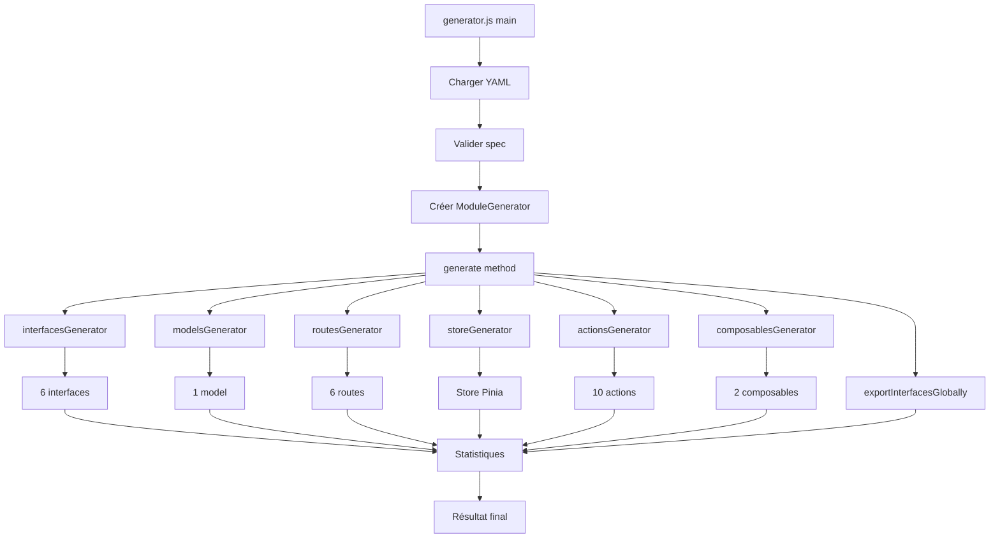

# Architecture Modulaire - Version 2.1

## 🏗️ Vue d'Ensemble

Le générateur de modules a été refactorisé en une architecture modulaire où chaque type de génération est géré par un générateur spécialisé.

## 📁 Structure Complète

```
generators/module/
├── 📄 generator.js              # Orchestrateur principal
├── ⚙️ config.js                 # Configuration centralisée
├── 🔧 helpers.js                # Helpers Handlebars
├── 📖 README.md                 # Documentation principale
├── 📚 Documentation/            # Docs supplémentaires
│   ├── MODERNIZATION.md
│   ├── ACTIONS.md
│   ├── CHANGELOG.md
│   ├── QUICK_START.md
│   └── ...
├── 📝 YAML Examples/
│   ├── example.yaml             # Exemple complet documenté
│   └── test-module.yaml         # Module de test
├── 🎨 templates/                # Templates Handlebars
│   ├── Interfaces/
│   │   ├── interface.hbs
│   │   ├── interface-create.hbs
│   │   ├── interface-update.hbs
│   │   ├── interface-store.hbs
│   │   ├── interface-list-filter.hbs
│   │   └── interface-index.hbs
│   ├── Models/
│   │   └── model.hbs
│   ├── Routes/
│   │   ├── route-base.hbs
│   │   ├── route-create.hbs
│   │   ├── route-list.hbs
│   │   ├── route-find.hbs
│   │   ├── route-update.hbs
│   │   └── route-delete.hbs
│   ├── Actions/
│   │   ├── action-add.hbs
│   │   ├── action-find.hbs
│   │   ├── action-update.hbs
│   │   ├── action-remove.hbs
│   │   ├── action-getAll.hbs
│   │   ├── action-findOne.hbs
│   │   ├── action-create.hbs
│   │   ├── action-updateOne.hbs
│   │   ├── action-delete.hbs
│   │   └── action-index.hbs
│   └── Composables/
│       ├── composable-use-actions.hbs
│       └── composable-use-filters.hbs
└── 🔨 generators/               # Générateurs spécialisés
    ├── README.md                # Documentation architecture
    ├── index.js                 # Export des générateurs
    ├── interfaces.js            # Génère les interfaces
    ├── models.js                # Génère les modèles
    ├── routes.js                # Génère les routes API
    ├── actions.js               # Génère les actions store
    ├── store.js                 # Génère le store Pinia
    └── composables.js           # Génère les composables Vue 3
```

## 🎯 Responsabilités

### Orchestrateur Principal (`generator.js`)

**Rôle :** Coordonne l'ensemble du processus de génération

**Responsabilités :**

- Charger et valider les fichiers YAML
- Gérer le mode interactif
- Coordonner les générateurs spécialisés
- Gérer les templates Handlebars
- Exporter les interfaces globalement
- Afficher les statistiques et erreurs

**Ne fait PAS :**

- Logique métier spécifique à un type de génération
- Manipulation directe de templates spécifiques

### Configuration (`config.js`)

**Rôle :** Centralise toute la configuration

**Contient :**

- Chemins de base (templates, modules, resources)
- Références aux templates Handlebars
- Structure des dossiers du module
- Valeurs par défaut
- Options de génération
- Messages et emojis

### Helpers (`helpers.js`)

**Rôle :** Fonctions utilitaires pour Handlebars

**Expose :**

- Transformations de casse (pascalCase, camelCase, kebabCase, etc.)
- Pluralisation/singularisation
- Comparaisons et conditions
- Helpers de formatage

### Générateurs Spécialisés (`generators/`)

Chaque générateur hérite du pattern :

```javascript
export class XGenerator {
	constructor(moduleGenerator, config) {
		this.moduleGenerator = moduleGenerator;
		this.config = config;
	}

	generate(modulePath, spec) {
		// Logique spécifique
	}
}
```

#### InterfacesGenerator

Génère : 6 interfaces TypeScript + index

#### ModelsGenerator

Génère : 1 modèle métier

#### RoutesGenerator

Génère : 1 route de base + 5 routes CRUD

#### ActionsGenerator

Génère : 4 actions de base + 5 actions API + index

#### StoreGenerator

Génère : Store Pinia complet via script existant

#### ComposablesGenerator

Génère : 2 composables Vue 3 (actions + filters)

## 🔄 Flux de Génération



## ✨ Avantages de l'Architecture

### 1. Séparation des Responsabilités (SRP)

Chaque générateur a une seule raison de changer.

### 2. Open/Closed Principle

Ouvert à l'extension (nouveaux générateurs), fermé à la modification (code existant stable).

### 3. Maintenabilité

- Code organisé et facile à naviguer
- Modifications localisées
- Pas de fichiers de 500+ lignes

### 4. Testabilité

Chaque générateur peut être testé indépendamment :

```javascript
const generator = new InterfacesGenerator(mockModuleGen, config);
generator.generate("/path", spec);
// Assert fichiers créés
```

### 5. Réutilisabilité

Les générateurs peuvent être utilisés dans d'autres contextes :

```javascript
// Générer uniquement les interfaces pour un module existant
const interfacesGen = new InterfacesGenerator(moduleGen, config);
interfacesGen.generate(existingModulePath, spec);
```

### 6. Extensibilité

Ajouter un nouveau type de génération est simple :

```javascript
// 1. Créer generators/pages.js
export class PagesGenerator {
	generate(modulePath, spec) {
		// ...
	}
}

// 2. Ajouter à generators/index.js
export { PagesGenerator } from "./pages.js";

// 3. Initialiser dans generator.js
this.pagesGenerator = new PagesGenerator(this, config);

// 4. Utiliser
this.pagesGenerator.generate(modulePath, spec);
```

### 7. Lisibilité

Le code du générateur principal est maintenant très clair :

```javascript
// Avant (240 lignes de logique mélangée)
generateInterfaces(modulePath, spec) {
	// ... 60 lignes ...
}
generateModel(modulePath, spec) {
	// ... 20 lignes ...
}
// ... etc ...

// Après (lignes épurées)
generateInterfaces(modulePath, spec) {
	this.interfacesGenerator.generate(modulePath, spec);
}
```

## 📊 Statistiques

### Avant Refactorisation

- `generator.js` : ~650 lignes
- 1 fichier monolithique
- Logique mélangée

### Après Refactorisation

- `generator.js` : ~400 lignes (-38%)
- 7 générateurs spécialisés : ~150 lignes chacun
- Séparation claire des responsabilités

### Code Généré par Module

Pour une ressource `Product` :

- **6 interfaces** TypeScript
- **1 modèle** métier
- **6 routes** API
- **1 store** Pinia complet
- **10 actions** store
- **2 composables** Vue 3

**Total : ~26 fichiers** générés automatiquement ! 🚀

## 🎓 Patterns Utilisés

### 1. Composition over Inheritance

Les générateurs sont composés dans `ModuleGenerator`, pas hérités.

### 2. Dependency Injection

Les générateurs reçoivent leurs dépendances (moduleGenerator, config) dans le constructeur.

### 3. Single Responsibility

Chaque générateur a une seule responsabilité bien définie.

### 4. Strategy Pattern

Chaque générateur est une stratégie de génération interchangeable.

### 5. Template Method

Les générateurs suivent tous le pattern `generate(modulePath, spec)`.

## 🔧 Personnalisation

### Modifier un générateur existant

```javascript
// generators/interfaces.js
generate(modulePath, spec) {
    console.log('🎨 Génération personnalisée');

    // Ajouter une interface custom
    this.moduleGenerator.createFileFromTemplate(
        'mon-interface-custom.hbs',
        path.join(interfacesPath, 'custom.ts'),
        context
    );

    // Logique standard
    // ...
}
```

### Créer un nouveau générateur

Voir section Extensibilité ci-dessus et [generators/README.md](./generators/README.md).

## 📚 Documentation

- [README.md](./README.md) - Guide principal
- [generators/README.md](./generators/README.md) - Architecture des générateurs
- [MODERNIZATION.md](./MODERNIZATION.md) - Patterns modernes
- [ACTIONS.md](./ACTIONS.md) - Actions personnalisées
- [QUICK_START.md](./QUICK_START.md) - Démarrage rapide

## 🎯 Prochaines Étapes Possibles

1. **Générateur de Vues** : Créer automatiquement les pages Vue
2. **Générateur de Tests** : Créer les tests unitaires
3. **Générateur de Documentation** : Créer les docs API
4. **Générateur de Validations** : Créer les schémas de validation
5. **CLI Amélioré** : Interface en ligne de commande plus riche

## 🤝 Contribution

L'architecture modulaire facilite les contributions :

1. Fork le projet
2. Créer un nouveau générateur dans `generators/`
3. Ajouter les tests
4. Documenter dans le README du générateur
5. Soumettre une PR

## 📞 Support

Pour questions sur l'architecture :

1. Consulter [generators/README.md](./generators/README.md)
2. Examiner un générateur existant comme exemple
3. Utiliser `--dry-run` pour tester
4. Contacter l'équipe de développement

---

**Version :** 2.1  
**Date :** Novembre 2025  
**Auteur :** Adébayo Floriano Davidio Sergio Gomez
